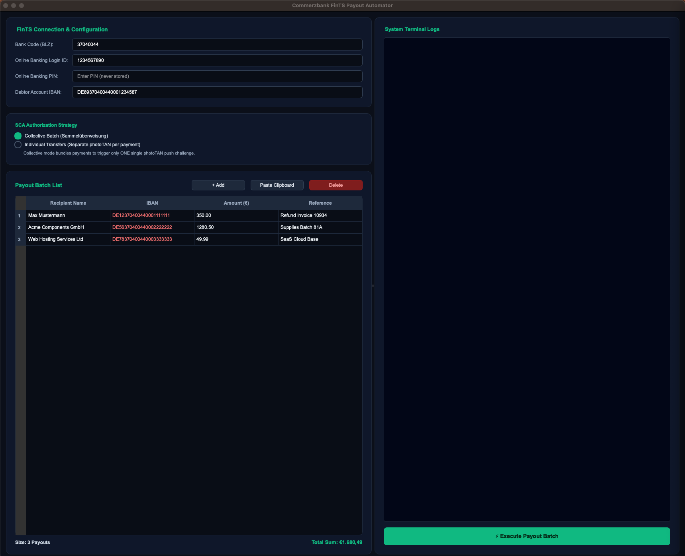

# Commerzbank FinTS Payout Automator

> A modern Qt6 desktop application for automating SEPA bank transfers through Commerzbank's FinTS interface with photoTAN authentication.


## 📸 Screenshot



## ✨ Features

- 🔐 **Secure FinTS Connection** - SSL/TLS encrypted communication with Commerzbank
- 📊 **Batch Payout Management** - Interactive table for managing multiple SEPA transfers
- ✅ **Real-time IBAN Validation** - MOD-97 checksum validation with visual feedback
- 📱 **photoTAN Integration** - Interactive challenge-response authentication
- 🔄 **Transfer Strategy Selection** - Collective batch or individual transfer modes
- 📋 **Clipboard Import** - Quick data import from spreadsheet applications
- 💻 **Terminal Logging** - Real-time operation feedback with color-coded messages
- ⚡ **Non-blocking Operations** - Background thread handling prevents UI freezing

## 🎯 Use Cases

### For Small Business Owners
Process bulk vendor payments efficiently with single photoTAN authentication for multiple transfers.

### For Accounting Departments  
Automate recurring payout operations with comprehensive audit trails and validation.

### For Finance Teams
Execute secure bank transfers with granular approval workflow and real-time monitoring.

## 🚀 Installation

### Prerequisites
- Python 3.14 or higher
- Stable internet connection
- Commerzbank online banking with photoTAN access

### Quick Start

```bash
# Clone the repository
git clone https://github.com/CJ-1981/commerzbank-fints.git
cd commerzbank-fints

# Install dependencies
pip install PyQt6 fints

# Run the application
python commerzbank_fints_qt_desktop_app.py
```

## 📖 Usage

### First Time Setup

1. **Launch the application** - Start `commerzbank_fints_qt_desktop_app.py`
2. **Enter credentials** - Provide your Commerzbank online banking details
3. **Verify connection** - Application retrieves your account information
4. **Configure settings** - Set up default transfer preferences

### Creating a Batch Transfer

1. **Add payout rows** - Enter recipient details (name, IBAN, amount, purpose)
2. **Validate IBANs** - Automatic MOD-97 checksum validation with color feedback
3. **Import data** (optional) - Paste tab-separated data from spreadsheet
4. **Review totals** - Check batch summary and calculated sums
5. **Choose strategy** - Select collective batch (single photoTAN) or individual transfers
6. **Execute** - Start batch processing
7. **Authenticate** - Respond to photoTAN prompts on your smartphone
8. **Monitor progress** - Real-time status updates in terminal log

## 🔒 Security

- **PIN Protection** - Never stored in memory or configuration files
- **Two-Factor Authentication** - photoTAN required for all transfers
- **Encrypted Communication** - SSL/TLS connections to FinTS servers
- **No Credential Persistence** - Fresh authentication each session
- **Thread-Safe Operations** - Secure cross-thread data handling

## 🏗️ Technical Architecture

- **Language**: Python 3.14+
- **GUI Framework**: PyQt6 (Qt6)
- **Banking Protocol**: python-fints (FinTS/HBCI)
- **Architecture**: Event-driven threaded design
- **Thread Safety**: Signal-slot pattern for UI/worker coordination

### Architecture Highlights

- **UI Thread**: Responsive Qt6 interface with real-time updates
- **Worker Thread**: Background FinTS operations without blocking
- **Thread Coordination**: Event-based synchronization for photoTAN handling
- **Validation Layer**: Embedded MOD-97 IBAN checking for immediate feedback

## 📋 System Requirements

- **Operating System**: Windows 10+, macOS 11+, or modern Linux
- **Memory**: 4GB RAM minimum (8GB recommended)
- **Display**: 1024x768 minimum (1100x750 optimized)
- **Network**: Stable internet connection required

## 🛠️ Development

### Project Structure
```
commerzbank-fints/
├── commerzbank_fints_qt_desktop_app.py  # Main application
├── .moai/                                 # Project documentation
├── .claude/                               # Development framework
└── README.md                             # This file
```

### Key Technologies
- **PyQt6**: Modern Qt6 Python bindings for desktop GUI
- **python-fints**: Open-source FinTS/HBCI implementation
- **threading**: Background operation management
- **decimal**: Precise financial calculations

## 🤝 Contributing

Contributions are welcome! Please feel free to submit issues or pull requests.

## 📄 License

This project is licensed under the MIT License - see the LICENSE file for details.

## ⚠️ Disclaimer

This software is provided as-is for educational and personal use. The authors are not responsible for any financial losses or damages resulting from its use. Always verify transactions through your official banking channels.

## 🔗 Resources

- [FinTS Protocol Documentation](https://www.hbci-zka.de/)
- [python-fints Library](https://github.com/phython/python-fints)
- [PyQt6 Documentation](https://www.riverbankcomputing.com/static/Docs/PyQt6/)

## 📞 Support

For issues, questions, or contributions, please visit the [GitHub repository](https://github.com/CJ-1981/commerzbank-fints).

---

**Made with ❤️ for automated banking workflows**
